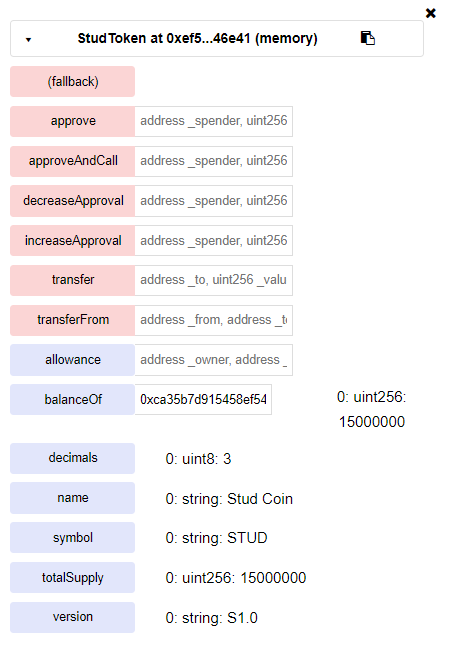

# Тестирование функционала STUD Token-а

### Создание контракта с 15,000,000 токенами

### Public-поля токена

Баланс указан для создателя контракта (0xca35b7d915458ef540ade6068dfe2f44e8fa733c). Allowance будет протестирован далее в методах контракта.

### Методы контракта
Сокращения:
Creator - создатель контракта(0xca35b7d915458ef540ade6068dfe2f44e8fa733c)
User - аккаунт для примеров (0x14723a09acff6d2a60dcdf7aa4aff308fddc160c)

1. Approve - метод ERC20-токена, позволяет выделить токены в пользование другому аккаунту.
Аргументы:
* address _spender - адрес, которому выделяем в пользование токены
* uint256 _value - количество токенов
Одобрим выделение 5,000,000 токенов для User. Результат можно увидеть через публичый view контракта allowance:

2. decreaseApproval / increaseApproval - методы ERC20-токена. Соответственно уменьшение и увеличение количества выделенных другому аккаунту токена.
Аргументы:
* address _spender
* uint256 _value
Уменьшим это количество для User на 2,000,000 (результат операции в поле allowance):

3. TransferFrom - метод ERC20-токена. Позволяет аккаунту использовать выделенные ему другим аккаунтом токены (через методы approve, decreaseApproval и increaseApproval)
Аргументы:
* address _from - чьи выделенные средства используем
* address _to - кому переводим
* uint256 _value - количество токенов
Потратим имеющиеся 3,000,000 токенов на аккаунте User

Сменим аккаунт:

Переведем 3,000,000 с адреса Creator-а токенов на любой адрес и проверяем баланс Creator-а и остаток выделенных User-у средств:

